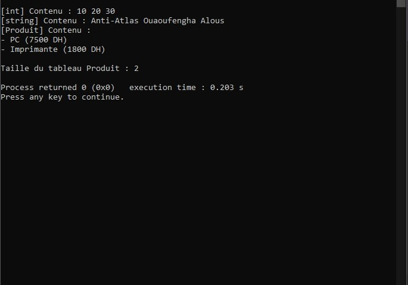
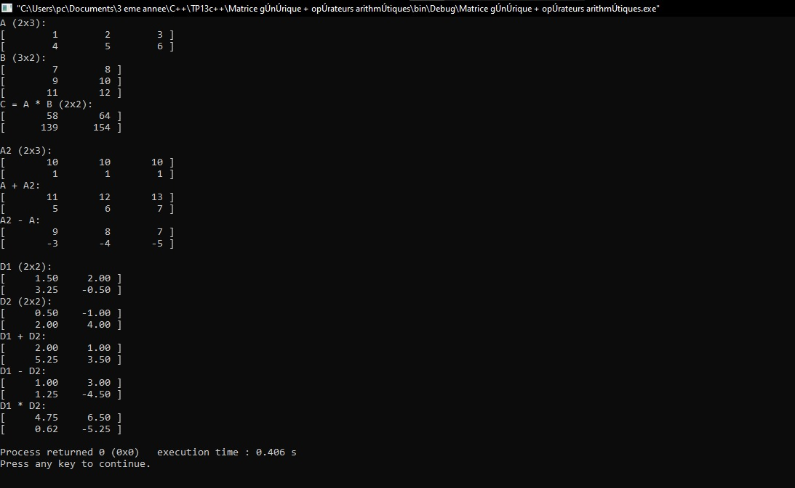
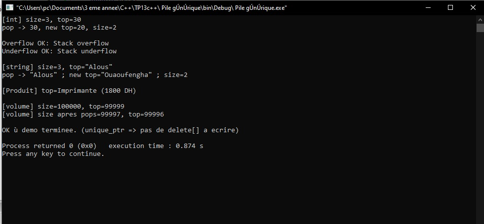
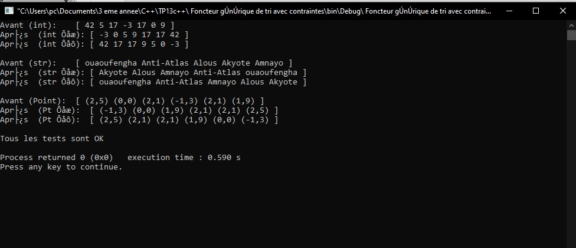

# TP13 — Templates et Généricité en C++

## 🎯 Objectif global
Ce TP a pour but d’appliquer la généricité en C++ à travers quatre exercices :  
conteneurs dynamiques, opérations matricielles, structures mémoire intelligentes et concepts C++20.

---

## 🧩 Exercice 1 — Conteneur générique `ArrayDyn<T>`

### Objectif
Créer une classe template imitant un mini-`std::vector` :
- Gestion dynamique avec `new[]` et `delete[]`
- Méthodes : `push_back`, `pop_back`, `operator[]` (avec contrôle des bornes)
- Classe interne `Iterator` compatible avec les boucles `for(auto &e : array)`

###  Résultat visuel

  
<em>Figure 1</em>
 

---

## 🧮 Exercice 2 — Matrice générique et opérateurs arithmétiques

### Objectif
Créer `Matrice<T,N,M>` avec :
- Constructeur par défaut (zéros)
- Constructeur par liste d’initialisation
- Surcharges :
  - `operator+`, `operator-` → addition/soustraction élément par élément
  - `operator*` → produit matriciel `(N×M) * (M×P) = (N×P)`
  - `operator<<` → affichage formaté

###  Résultat visuel

  
<em>Figure 2</em>
 

---

## 🧱 Exercice 3 — Pile générique sécurisée (`Stack<T>`)

### Objectif
Implémenter une pile générique avec :
- `std::unique_ptr<T[]>`
- Exceptions : `StackOverflow`, `StackUnderflow`
- Constructeur par défaut (capacité) et par itérateurs
- Méthodes : `push`, `pop`, `peek`, `empty`

###  Résultat visuel

  
<em>Figure 3</em>
 

---

## ⚙️ Exercice 4 — Foncteur générique de tri (`quickSort` + Concepts C++20)

### Objectif
Implémenter un tri rapide générique avec :
- Concept `Sortable`
- Foncteurs `Asc` et `Desc`
- Fonction template `quickSort(std::vector<T>&, Comp comp = Comp{})`
- Tests sur `int`, `std::string`, et une structure `Point`

###  Résultat visuel

  
<em>Figure 4</em>
 

